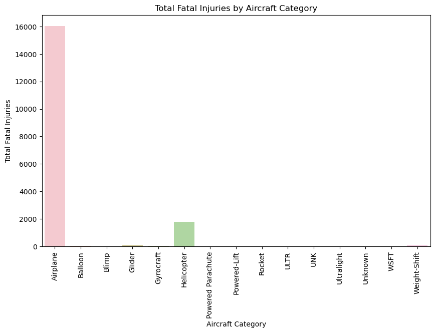
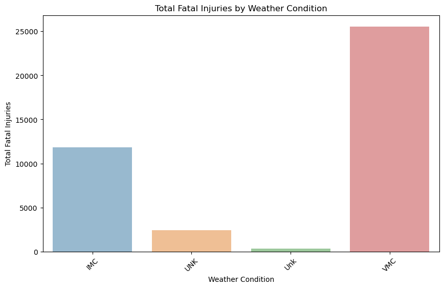
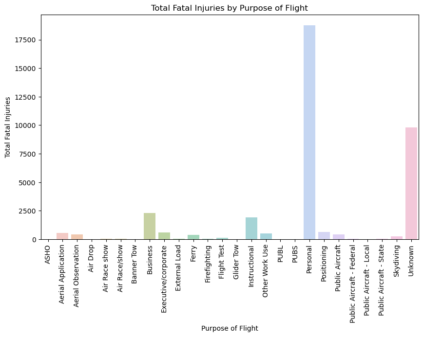

# PHASE 1 PROJECT: AVIATION ANALYSIS

## Description
This project has a simple function of taking a dataset and breaking it down to provide key information like aircraft type, purpose of flight, weather conditions, and it relates those information to other data like the fatalities, serious and minor injories as well as the uninjured. There are also graphs that primarily focus on the fatalities in accordance to those keys factors

## Business Understanding

### Business problem
The company is expanding in to new industries to diversify its portfolio. Specifically, they are interested in purchasing and operating airplanes for commercial and private enterprises, but do not know anything about the potential risks of aircraft. We will be determining which aircraft are the lowest risk for the company to start this new business endeavor. We will then translate the findings into actionable insights that the head of the new aviation division can use to help decide which aircraft to purchase.

## Data Understanding
### Source of data
the data beig used is found at kaggle [here](https://www.kaggle.com/datasets/khsamaha/aviation-accident-database-synopses/data)

### Description of the data
it consists of two main files:
1) `AviationData.csv` : The NTSB aviation accident database contains information from 1962 and later about civil aviation accidents and selected incidents within the United States, its territories and possessions, and in international waters. 

2) `USState_Codes.csv` :This file contains the US State name and the abbreviation of them

### Example outputs from the data

From the data used we can also get an interactive [dashboard](https://public.tableau.com/app/profile/alvin.ogam/viz/Fatal-Injuries-Under-Various-Conditions/Dashboard1) by the use of Tableau. This dashboard shows the relation of fatal injuries and various conditions

## Conclusions
1) We will draw our first conclusion from the first graph where we are looking at the fatalities accross each type of available aircraft. Now it is keen to note that the most fatlities occur when the type of aircraft being used is an airolane. This is rightfully so since they are the ones that carry the most ammount of people and are the most common tpye of airplanes in service. However, this does mean that they have the highest risk since even though they have potential to bring in the most revenue

2) The second observation is that since the most amount fatalities occur in airplanes and the most cause of fatalities in reason for flight is personal, we can deduce that the most number of fatalitities that occur are in airplane where people are using then for personal use

3) To sum it all up, it is clear that the most common cause of fatalities might end up having the most risk it is also keen to note that it is due to the high volume of traffic that it has
